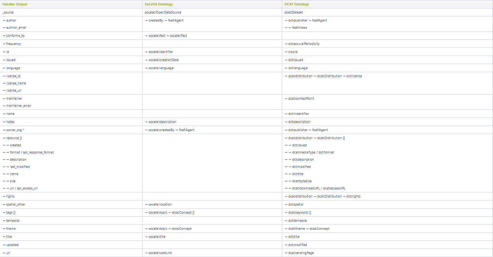
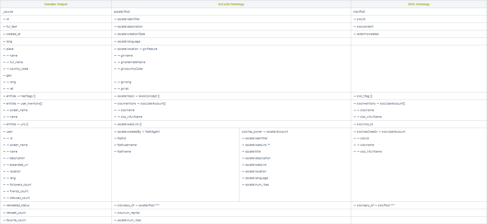
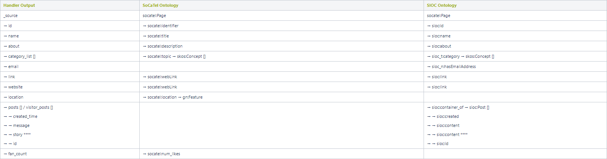
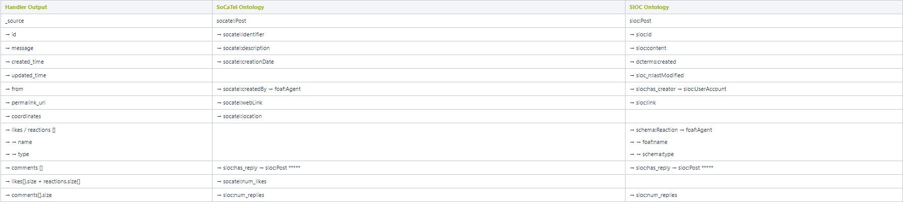
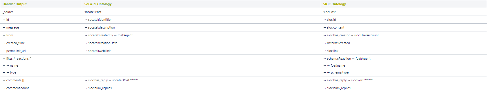
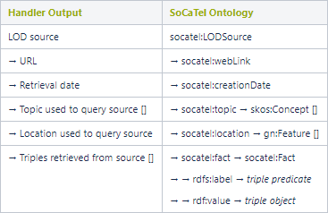
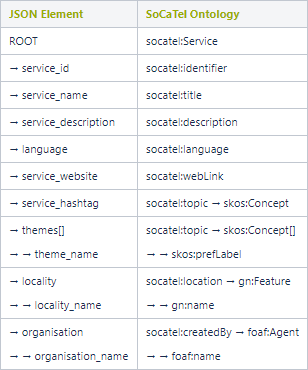

# **Ontology Mappings**
## Open Data Handler

\* Use  _owner_org_  if _author_  is empty. This preference can be changed to always use  _owner_org_ for instance.

## Social Media Handler

### Twitter Handler

** Construct web link to user profile from Twitter username.

*** The mapping of the retweeted status is the same as the original status found in __source_.

### Facebook Handler

**Note:** it is important to note that the Facebook handler does _not_  include a language attribute in any of its output formats. As this is an essential attribute in linking sources together, the  _socatel:language_  attribute will be created by automatically detecting the language of Facebook posts, comments and page descriptions.

#### Facebook Page

  
**** Use _story_  only if _message_  is empty. Alternatively, a concatenation of both can also be used.

#### Facebook Post

***** The mappings of Facebook comments is explained below.

#### Facebook Comment

****** Each comment reply has the same mappings as the original __source_  mapping.

## Linked Open Data Handler

The Linked Open Data Handler is different than other handler in the sense that the data it provides does not conform to a predefined format. Instead, each LOD source has its own ontology and thus having a one-to-one direct mapping with the SoCaTel Core Ontology is not practical. For this reason, the main properties of the core ontology will be used to retrieve data from the handler, and each retrieved triple pattern will be mapped using the abstract _socatel:fact_  property.

## SoCaTel Service

This mapping is done based on the SoCaTel Database Model of registered services and their related information (language, theme and organisation). An example of the expected JSON file format can be found in this attached file: [Service JSON Sample](resources/services_sample_1.json).

