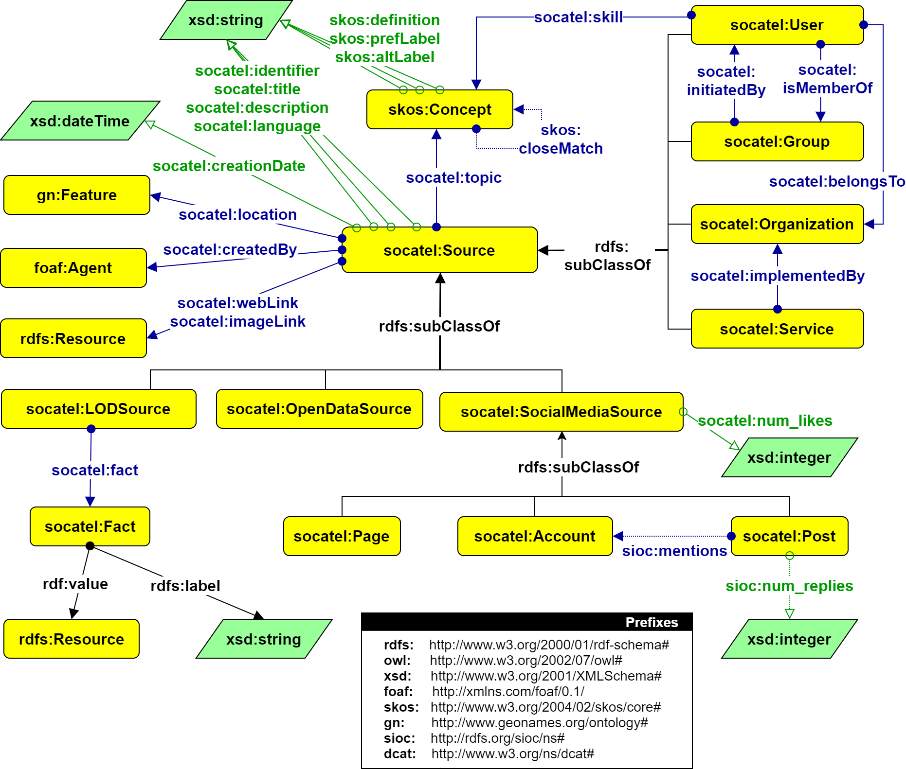

# **SoCaTel Core Ontology**

This page exposes the design of the SoCaTel Core Ontology, which aims at capturing information relevant to the SoCaTel platform, as retrieved from external sources. Given the diversity of the external data sources used (e.g. social media, open data, etc), the ontolgoy was designed with a high-level of abstraction in order to represent information accross the different data sources. Furthermore, the ontology was linked to various external ontologies, each specific to a different type of data sources, in order to represent more specialized information.

The core ontology is defined in OWL format in the file attached at the end of this page. Fig. 1 below shows the design of the SoCaTel core ontology. Alternatively, the ontology can be visualized using  [WebVOWL](http://www.visualdataweb.de/webvowl/) by uploading the attached OWL file.

**_Fig. 1: SoCaTel Core Ontology_**

The main concepts and relations of this ontology are the following:

-   **socatel:ExternalSource:**  the core concept of the ontology. It is an abstract concept that represents all external sources used in SoCaTel. It has many properties representing various pieces of information retrieved from the sources (e.g. title, description, language, location, web link, etc). It also has several subclasses which correspond to different types of sources.  
    -   **socatel:topic:**  is a relation that defines one or more topics related to an ExternalSource. An external ontology specialized in classification schemes and taxonomies,  [SKOS](https://www.w3.org/2004/02/skos/), was used to represent the topics and, if needed, organize them into  _schemes._
-   **socatel:LODSource:**  a subclass of _socatel:ExternalSource_  used to represente Linked Open Data sources. It does not have any additional properties or relations.
-   **socatel:OpenDataSource:**  a subclass of _socatel:ExternalSource_  used to represent Open Data sources. Using _owl:sameAs_, it is declared as an equivalent class of  _dcat:Dataset_ from the  [DCAT](ExternalOntologies.md#dcat-open-data-sources)) ontology, which can be used to represent additional information about open data sources.
-   **socatel:SocialMediaSource:**  a subclass of _socatel:ExternalSource_ used to represent Social Media sources. Using _owl:sameAs_, the different _instances_ of this class are decalred as equivalent to instances of different classes from the  [SIOC](ExternalOntologies.md#sioc-social-media-sources)  ontology (e.g. post, user account, page), depending on which type of entity they represent.
-   **socatel:Page:** a class defined as an extension to the SIOC ontology to represent Facebook pages. It is declared as a subclass of _sioc:Container._
-   **socatel:fact**_**:** a_ high-level property used to represent additional information retrieved from external LOD sources. Each property leads to a _socatel:Fact_ concept, which in turn has an _rdfs:label_ that describes the fact and an _rdf:value_ that has the value of the fact. This property was introduced to avoid creating different concepts for each piece of retrieved information and should only be used to represent essential information about the source.

The mapping between each type of external sources and the SoCaTel core ontology is discussed in detail in the page  [Ontology Mappings](OntologyMappings.md).
 